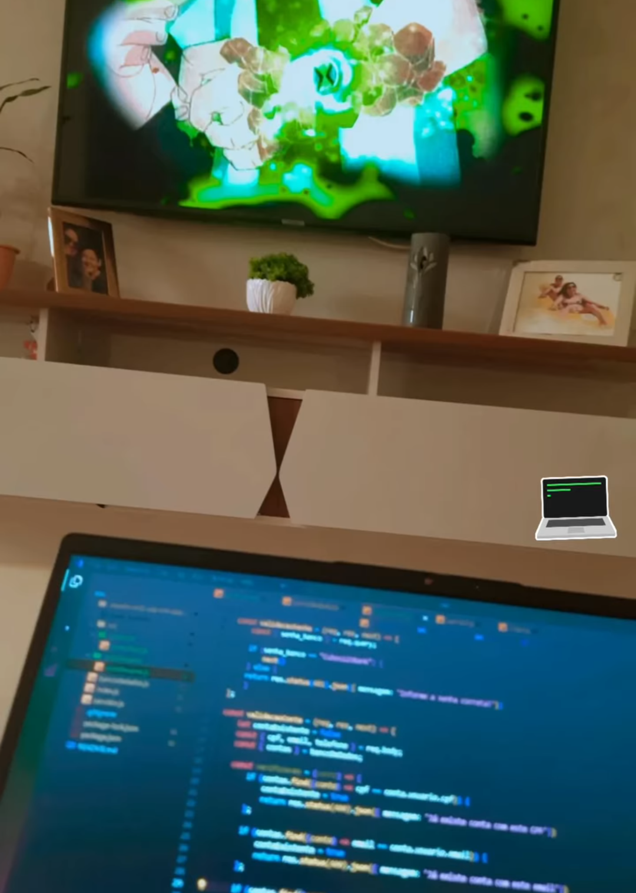

## 

## Um pouco sobre mim 🗽👋

#### 😏 'Idéias e somente idéias podem iluminar a escuridão.' -Ludwig Von Mises; 
Hodiernamente, o princípio desta frase ressignifica minha vida trazendo leveza e simplicidade aos meus dias. Completamente apaixonado por tecnologias me levando ao mundo Dev... 

🌱 Estou aprendendo [Js](https://https://www.javascript.com/) e [Node.js](https://nodejs.org/en/learn/getting-started/introduction-to-nodejs).

🤳 Você pode me comunicar em um [email](mailto:raul_lopes11k@outlook.com) ou até mesmo via [Telegram](https://t.me/Rauulkp), e retornarei o mais breve possível!

👨‍💻 Gentilmente peço que acesse minha [Página profissional](https://www.linkedin.com/in/raul-lopes-3460411b6/), onde possa ver um pouco mais sobre meu trabalho.

## ⚙️ Analytics ⚙️

⏳ Tenho registrado meu tempo em coding com [WakaTime](https://wakatime.com/).

